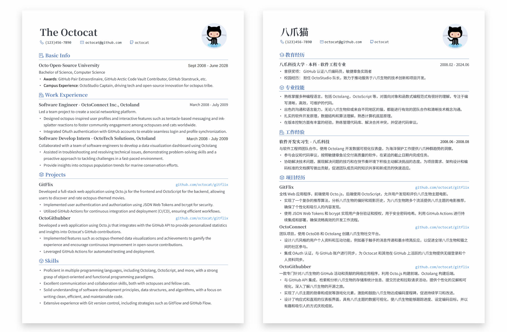
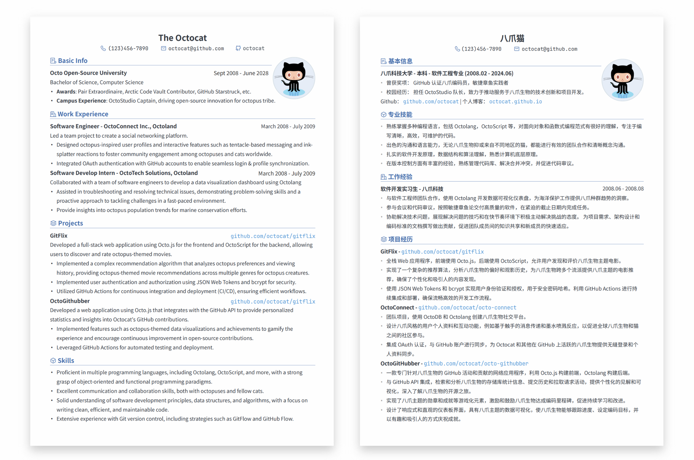
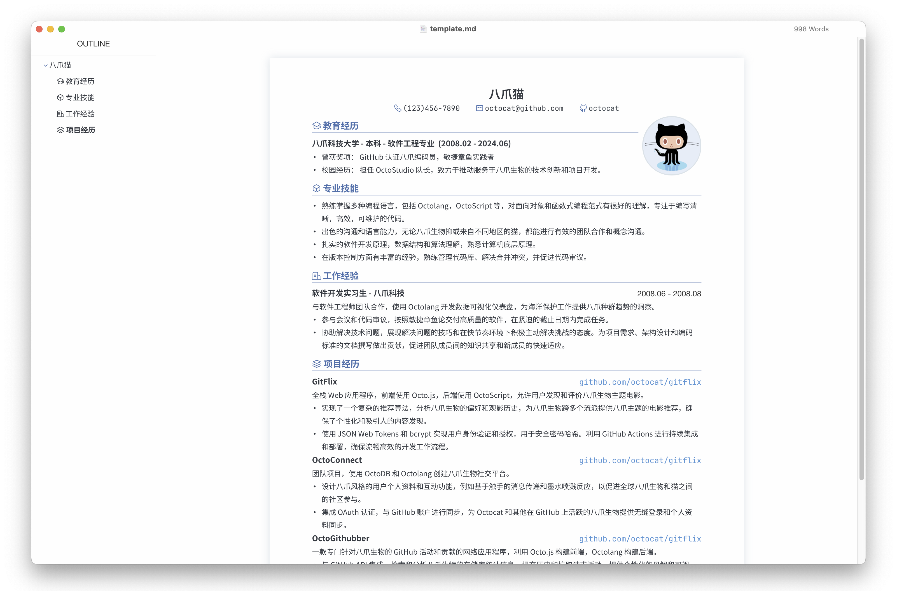
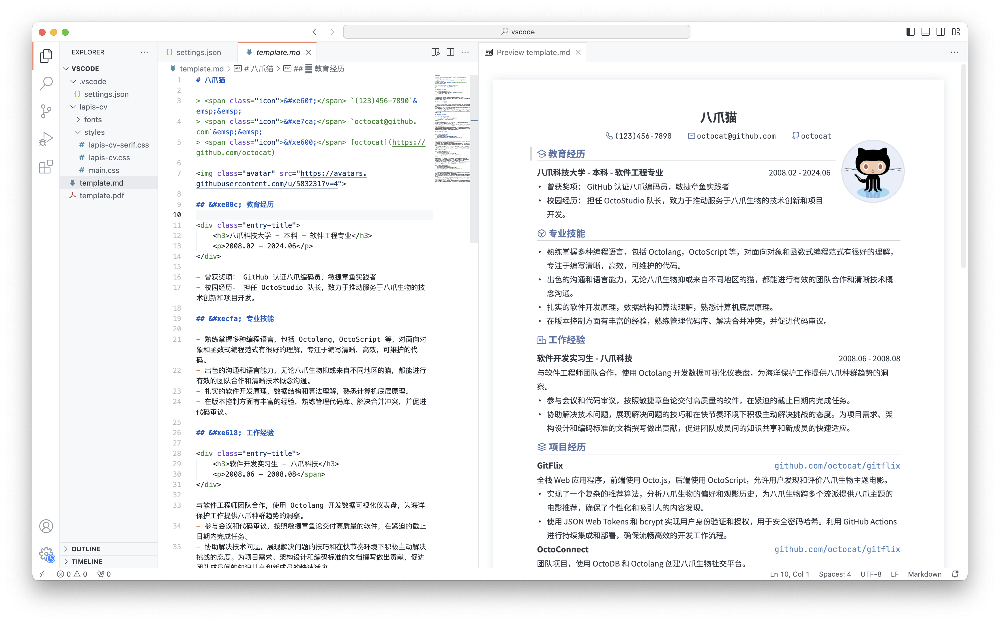
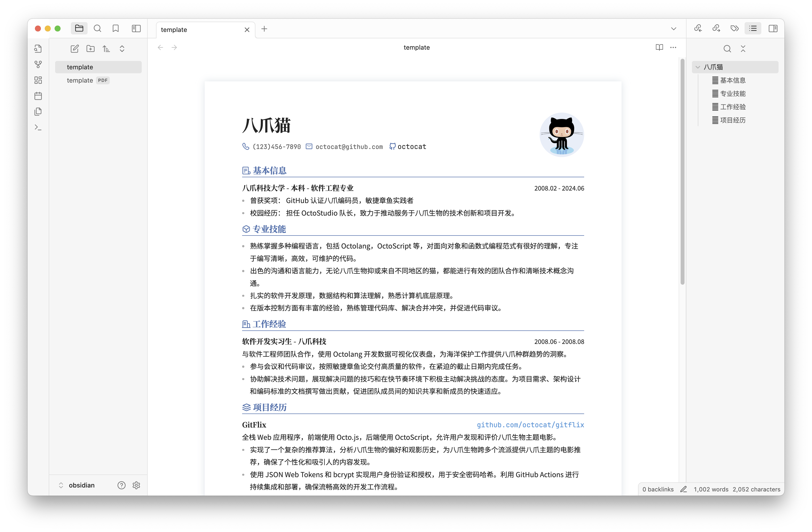
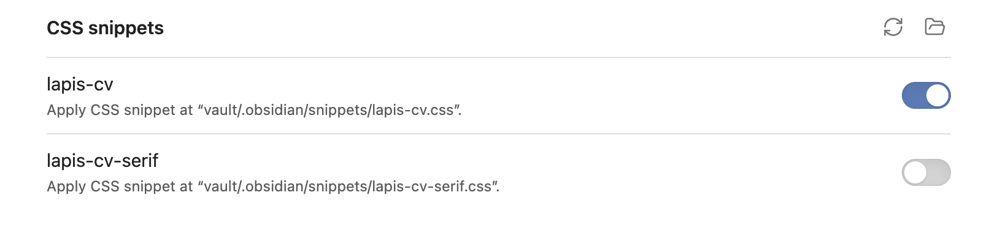

<<<<<<< HEAD
<<<<<<< HEAD

# 模板介绍

| 项目信息       | 详情                                                                                  |
| -------------- | ------------------------------------------------------------------------------------- |
| 原始项目地址   | [ justboil/admin-one-vue-tailwind](https://github.com/justboil/admin-one-vue-tailwind)                                 |
| 原始项目Stars   | [](https://github.com/justboil/admin-one-vue-tailwind/stargazers) |

> 以下是原始项目的 README 内容：

---

# [Admin One &mdash; 带深色模式的免费 Vue 3.x Tailwind 3.x 管理仪表板](https://justboil.me/tailwind-admin-templates/free-vue-dashboard/)

[](https://justboil.me/tailwind-admin-templates/free-vue-dashboard/) [](https://justboil.me/tailwind-admin-templates/free-vue-dashboard/)

### Tailwind 3.x Vue 3.x 带 Vite 或 Nuxt 或 Laravel

[](https://justboil.github.io/admin-one-vue-tailwind/)

[](https://justboil.github.io/admin-one-vue-tailwind/)

### Tailwind 3.x Vue 3.x 搭配 Vite 或 Nuxt 或 Laravel

**Admin One** 是简单、美观且免费的 Vue.js 3.x Tailwind CSS 3.x 管理仪表板。可与 Nuxt 3.x 或 Laravel 9.x 集成

* 使用 **Vue.js 3**、**Tailwind CSS 3** 框架和 **Composition API** 构建
* **Vite** 底层 &mdash; [信息](https://vitejs.dev)
* **Nuxt 3** 集成可用 &mdash; [信息](#nuxt-3-integration)
* **Laravel Breeze Inertia Vue** 集成可用 &mdash; [信息](#laravel-9x-integration)
* **SFC** `<script setup>` &mdash; [信息](https://v3.vuejs.org/api/sfc-script-setup.html)
* **Pinia** 状态库（官方 Vuex 5）&mdash; [信息](https://pinia.vuejs.org/)
* **暗模式**
* **样式化**滚动条
* 带**路由器**的 SPA
* **生产 CSS** 仅 **&thickapprox;38kb**
* 可重复使用的组件
* 根据 MIT 许可免费提供
* [高级版本](https://justboil.me/tailwind-admin-templates/vue-dashboard/) 可用

## 目录

* [React TypeScript 版本](#looking-for-react-typescript-version)
* [响应式布局](#responsive-layout)
* [移动和平板电脑](#mobile--tablet)
* [小型笔记本电脑](#small-laptops-1024px)
* [笔记本电脑和台式机](#laptops--desktops)
* [演示](#demo)
* [免费仪表板演示](#free-dashboard-demo)
* [高级仪表板演示](#premium-dashboard-demo)
* [快速入门](#quick-start)
* [获取代码并安装](#get-code--install)
* [Vite 构建](#vite-builds)
* [Linting](#linting)
* [Nuxt 3.x 集成](#nuxt-3x-integration)
* [Laravel 9.x 集成](#laravel-9x-integration)
* [文档](#docs)
* [浏览器支持](#browser-support)
* [报告问题](#reporting-issues)
* [许可](#licensing)
* [有用的链接](#useful-links)

## 正在寻找 React TypeScript 版本？

这是 **Tailwind Vue 仪表板** 版本

正在寻找 **Tailwind React TypeScript**？检查 [Admin One - React TypeScript Tailwind 仪表板](https://github.com/justboil/admin-one-react-tailwind) 版本

## 响应式布局

### 移动和平板电脑

带有隐藏侧边菜单和可折叠卡片和表格的移动布局

[](https://justboil.github.io/admin-one-vue-tailwind/)

### 小型笔记本电脑 1024px

带有显示/隐藏侧边菜单选项的小型笔记本电脑布局

[](https://justboil.github.io/admin-one-vue-tailwind/)

[](https://justboil.github.io/admin-one-vue-tailwind/)

### 笔记本电脑和台式机

经典布局，左侧有侧边菜单

[](https://justboil.github.io/admin-one-vue-tailwind/)

## 演示

### 免费仪表板演示

https://justboil.github.io/admin-one-vue-tailwind/

### 高级仪表板演示

https://tailwind-vue.justboil.me/

## 快速入门

获取代码并安装。然后使用 [Vite](#vite-builds) 进行 `dev` 或 `build`，或与 [Nuxt](#nuxt-3x-integration) 或 [Laravel](#laravel-9x-integration) 集成

* [获取代码并安装](#get-code--install)
* [Vite 构建](#vite-builds)
* [Linting](#linting)
* [Nuxt 3.x 集成](#nuxt-3x-integration)
* [Laravel 9.x 集成](#laravel-9x-integration)

### 获取代码并安装

#### 获取 repo

* [使用此模板创建新 repo](https://github.com/justboil/admin-one-vue-tailwind/generate)
* &hellip; 或在 GitHub 上克隆此 repo
* &hellip;或从 GitHub [下载 .zip](https://github.com/justboil/admin-one-vue-tailwind/archive/master.zip)

#### 安装

`cd` 到项目目录并运行 `npm install`

### Vite 构建

[Vite](https://vitejs.dev) 是下一代前端工具，具有未捆绑的 Web 开发功能

#### 用于开发的热重载

```
npm run dev
```

#### 用于生产的构建和最小化

```
npm run build
```

#### 提供最近构建的应用程序

```
npm run preview
```

### Linting

#### Lint

```
npm run lint
```

### Nuxt 3.x 集成

此仪表板可与 Nuxt 3.x 集成。[查看指南](https://github.com/justboil/admin-one-vue-tailwind/tree/master/.nuxt-guide) 了解更多信息

### Laravel 9.x 集成

此仪表板可与 Laravel 9.x Breeze Inertia + Vue.js 堆栈集成。 [查看指南](https://github.com/justboil/admin-one-vue-tailwind/tree/master/.laravel-guide) 了解更多信息

## 文档

自定义和信息：https://justboil.github.io/docs/

## 浏览器支持

我们尝试确保仪表板在所有主流浏览器的最新版本中都能正常工作

    

## 报告问题

JustBoil 的免费项目仅限于 GitHub 上的社区支持。

问题列表专门用于错误报告和功能请求。这意味着我们不接受使用问题。如果您打开的问题不符合要求，它将被关闭。

1. 确保您使用的是最新版本的仪表板。过时版本的问题无关紧要
2. 提供重现步骤
3. 提供预期行为
4. 描述实际发生的情况
5. 平台、浏览器和版本，因为某些问题可能特定于浏览器

## 许可

- 版权所有 &copy; 2019-2022 JustBoil.me (https://justboil.me)
- MIT 许可

## 有用的链接

- [JustBoil.me](https://justboil.me/)
- [Tailwind CSS](https://tailwindcss.com/)
- [Vue.js 3](https://v3.vuejs.org/)
- [Vite](https://vitejs.dev)

# [Admin One &mdash; Free Vue 3.x Tailwind 3.x Admin Dashboard with dark mode](https://justboil.me/tailwind-admin-templates/free-vue-dashboard/)

[](https://justboil.me/tailwind-admin-templates/free-vue-dashboard/)  [](https://justboil.me/tailwind-admin-templates/free-vue-dashboard/)

### Tailwind 3.x Vue 3.x with Vite or Nuxt or Laravel

[](https://justboil.github.io/admin-one-vue-tailwind/)

[](https://justboil.github.io/admin-one-vue-tailwind/)

### Tailwind 3.x Vue 3.x with Vite or Nuxt or Laravel

**Admin One** is simple, beautiful and free Vue.js 3.x Tailwind CSS 3.x admin dashboard. Nuxt 3.x or Laravel 9.x integrations available

* Built with **Vue.js 3**, **Tailwind CSS 3** framework & **Composition API**
* **Vite** under the hood &mdash; [Info](https://vitejs.dev)
* **Nuxt 3** integration available &mdash; [Info](#nuxt-3-integration)
* **Laravel Breeze Inertia Vue** integration available &mdash; [Info](#laravel-9x-integration)
* **SFC** `<script setup>` &mdash; [Info](https://v3.vuejs.org/api/sfc-script-setup.html)
* **Pinia** state library (official Vuex 5) &mdash; [Info](https://pinia.vuejs.org/)
* **Dark mode**
* **Styled** scrollbars
* SPA with **Router**
* **Production CSS** is only **&thickapprox;38kb**
* Reusable components
* Free under MIT License
* [Premium version](https://justboil.me/tailwind-admin-templates/vue-dashboard/) available

## Table of Contents

* [React TypeScript version](#looking-for-react-typescript-version)
* [Responsive layout](#responsive-layout)
  * [Mobile & tablet](#mobile--tablet)
  * [Small laptops](#small-laptops-1024px)
  * [Laptops & desktops](#laptops--desktops)
* [Demo](#demo)
  * [Free dashboard demo](#free-dashboard-demo)
  * [Premium dashboard demo](#premium-dashboard-demo)
* [Quick Start](#quick-start)
  * [Get code & install](#get-code--install)
  * [Vite builds](#vite-builds)
  * [Linting](#linting)
  * [Nuxt 3.x integration](#nuxt-3x-integration)
  * [Laravel 9.x integration](#laravel-9x-integration)
* [Docs](#docs)
* [Browser Support](#browser-support)
* [Reporting Issues](#reporting-issues)
* [Licensing](#licensing)
* [Useful Links](#useful-links)

## Looking for React TypeScript version?

This is **Tailwind Vue dashboard** version

Looking for **Tailwind React TypeScript**? Check [Admin One - React TypeScript Tailwind dashboard](https://github.com/justboil/admin-one-react-tailwind) version

## Responsive layout

### Mobile & tablet

Mobile layout with hidden aside menu and collapsable cards & tables

[](https://justboil.github.io/admin-one-vue-tailwind/)

### Small laptops 1024px

Small laptop layout with show/hide aside menu option

[](https://justboil.github.io/admin-one-vue-tailwind/)

[](https://justboil.github.io/admin-one-vue-tailwind/)

### Laptops & desktops

Classic layout with aside menus on the left

[](https://justboil.github.io/admin-one-vue-tailwind/)

## Demo

### Free Dashboard Demo

https://justboil.github.io/admin-one-vue-tailwind/

### Premium Dashboard Demo

https://tailwind-vue.justboil.me/

## Quick Start

Get code & install. Then `dev` or `build` with [Vite](#vite-builds) or integrate with [Nuxt](#nuxt-3x-integration) or [Laravel](#laravel-9x-integration)

* [Get code & install](#get-code--install)
* [Vite builds](#vite-builds)
* [Linting](#linting)
* [Nuxt 3.x integration](#nuxt-3x-integration)
* [Laravel 9.x integration](#laravel-9x-integration)

### Get code & install

#### Get the repo

* [Create new repo](https://github.com/justboil/admin-one-vue-tailwind/generate) with this template
* &hellip; or clone this repo on GitHub
* &hellip; or [download .zip](https://github.com/justboil/admin-one-vue-tailwind/archive/master.zip) from GitHub

#### Install

`cd` to project's dir and run `npm install`

### Vite builds

[Vite](https://vitejs.dev) is next Generation Frontend Tooling featuring unbundled web-development

#### Hot-reloads for development

```
npm run dev
```

#### Builds and minifies for production

```
npm run build
```

#### Serves recently built app

```
npm run preview
```

### Linting

#### Lint

```
npm run lint
```

### Nuxt 3.x integration

This dashboard can be integrated with Nuxt 3.x. [Check guide](https://github.com/justboil/admin-one-vue-tailwind/tree/master/.nuxt-guide) for more information

### Laravel 9.x integration

This dashboard can be integrated with Laravel 9.x Breeze Inertia + Vue.js stack. [Check guide](https://github.com/justboil/admin-one-vue-tailwind/tree/master/.laravel-guide) for more information

## Docs

Customization & info: https://justboil.github.io/docs/

## Browser Support

We try to make sure Dashboard works well in the latest versions of all major browsers

    

## Reporting Issues

JustBoil's free items are limited to community support on GitHub.

The issue list is reserved exclusively for bug reports and feature requests. That means we do not accept usage questions. If you open an issue that does not conform to the requirements, it will be closed.

1. Make sure that you are using the latest version of the Dashboard. Issues for outdated versions are irrelevant
2. Provide steps to reproduce
3. Provide an expected behavior
4. Describe what is actually happening
5. Platform, Browser & version as some issues may be browser specific

## Licensing

- Copyright &copy; 2019-2022 JustBoil.me (https://justboil.me)
- Licensed under MIT

## Useful Links

- [JustBoil.me](https://justboil.me/)
- [Tailwind CSS](https://tailwindcss.com/)
- [Vue.js 3](https://v3.vuejs.org/)
- [Vite](https://vitejs.dev)
=======
=======
>>>>>>> parent of ba7929b (delete)
<p align="right">
	English / 
	<a href="https://github.com/BingyanStudio/LapisCV/blob/main/README-CN.md">
    简体中文
	</a>
</p>

<h1 align="center">
    LapisCV
</h1>
<p align="center">
    📄 Easily create resumes with Markdown on VSCode / Typora / Obsidian
</p>
<div align="center">
    
    &nbsp;
    
    &nbsp;
      
</div><br>

## View Samples

<div align="center">
    
    <p>LapisCV Serif (new in v2.0.0)</p>
    
    <p>LapisCV</p>
    
    <p>Typora Editor</p>
</div>


## Quick Start

### Installation

<details>

<summary>Typora</summary>

1. Download [Release](https://github.com/BingyanStudio/LapisCV/releases/latest) and unzip, set the theme:

   1. Open Typora theme folder: `Preferences > Appearance > Open Theme Folder`
   2. Copy files to the theme folder: `lapis-cv.css`, `lapis-cv-serif.css`, `lapis-cv` directory
   3. Restart Typora, select `Lapis Cv` / `Lapis Cv Serif` from the theme menu.

2. Open template file to edit.
3. `File > Export > PDF` to export the PDF file.

   Before exporting, set the page size to A4 and margins to custom in `Preferences > Export > PDF`, with top and bottom margins of 13mm, and left and right margins of 15mm:

   

</details>

<details>

<summary>VSCode</summary>

1. Download [Release](https://github.com/BingyanStudio/LapisCV/releases/latest) and unzip, open the folder in VSCode.
2. Install the plugin [Markdown PDF](https://marketplace.visualstudio.com/items?itemName=yzane.markdown-pdf).
3. Open template file, click the preview icon in the top right to view the effect in real-time:

   

   Right-click and select Markdown PDF - Export (pdf) to export the PDF file.

4. Switch themes:
   
   Modify the style path in `.vscode/settings.json`:

   ```
   "markdown.styles": [
       "./lapis-cv/styles/main.css",
       "./lapis-cv/styles/lapis-cv.css", // lapis-cv-serif.css for Serif
   ],
   ```

> Other VSCode plugins may affect the style. If the effect is inconsistent, check if any plugins are interfering.

</details>

<details>

<summary>Obsidian</summary>

<br>

Download and unzip [Release](https://github.com/BingyanStudio/LapisCV/releases/latest), open the `lapis-cv-obsidian` directory as a Vault in Obsidian, edit the template, and export the PDF file.



Switch themes in `Options > Appearance > CSS snippets`



</details>

### Format and Style

<details>

<summary>Avatar</summary>

<br>

```html

```

Replace the src image path when editing the avatar. Delete this line if no avatar is needed.

> Obsidian cannot recognize local images inserted in HTML format, so it is recommended to upload the image as a link before inserting.

</details>

<details>
<summary>Icons</summary>

<br>

Supported Icons:

| Icon | Escaped Unicode | Icon | Escaped Unicode |
|------|-----------------|------|-----------------|
|  | `&#xe60f;` |  | `&#xe7ca;` |
|  | `&#xe600;` |  | `&#xe618;` |
|  | `&#xe80c;` |  | `&#xecfa;` |
|  | `&#xe69c;` |  | `&#xe6b3;` |
|  | `&#xe8ae;` |  | `&#xe782;` |
|  | `&#xe8b4;` |  | `&#xe603;` |
|  | `&#xe8b5;` |  | `&#xe638;` |
|  | `&#xe635;` |  | `&#xe673;` |

</details>

<details>

<summary>Page Breaks & Page Numbers</summary>

<br>

**Page Breaks**

Insert `---` at the position where a page break is needed.

**Page Numbers**

**Typora**

Set the footer in `Preferences > Export > PDF`, e.g., `${pageNo} / ${totalPages}`

**VSCode**

Modify `.vscode/settings.json`:

```
"markdown-pdf.displayHeaderFooter": true,
"markdown-pdf.headerTemplate": "<div></div>",
"markdown-pdf.footerTemplate": "<div style=\"font-size: 9px; margin: 0 auto;\"> <span class='pageNumber'></span> / <span class='totalPages'></span></div>",
```

**Obsidian**

The software itself does not support adding page numbers directly. You can install plugins for this.

</details>

<details>

<summary>Margins</summary>

<br>

**Typora**

`Preferences > Export > PDF`

**VSCode**

- Directly modify the `markdown-pdf.margin` related items in the `.vscode/settings.json` file.

- Alternatively, modify via GUI:

  1. Open VSCode settings, select the Workspace tab.
  2. Search for Markdown-pdf › Margin, and modify the margins on all sides.

**Obsidian**

Modify `--file-margins` in the style file, see Custom Styles below.

</details>

<details>

<summary>Custom Styles</summary>

<br>

Custom styles can be used to adapt to different content volumes and adjust details according to preferences.

Modify variables in the corresponding editor's style file `lapis-cv.css` / `lapis-cv-serif.css`:

##### Style File Locations

- Typora: `Preferences > Appearance > Open Theme Folder`
- VSCode: `lapis-cv/styles` in the folder
- Obsidian: `Options > Appearance > CSS snippets > Right button - Open snippets folder`

##### Meanings of Some Custom Variables

```css

/* Custom Configs */

/* Basic Configs */
--text-size: 10pt;                      /* Text font size */
--line-height: 1.8;                     /* Text line height */
--avatar-width: 29mm;                   /* Avatar width */

/* Font Configs */
--h1-size: 16pt;                        /* Level 1 heading font size */
--h2-size: 12pt;                        /* Level 2 heading font size */
--h3-size: 10.5pt;                      /* Level 3 heading font size */
--blockquote-size: 9.3pt;               /* Info block font size */

--text-font: 'SourceHanSansCN';         /* Text font */
--title-font: 'SourceHanSerifCN';       /* Title font */
--link-font: 'JetBrainsMono';           /* Link font */
--code-font: 'JetBrainsMono';           /* Code font */

/* Colors */
--color-accent: #4870ac;                /* Theme color */
--text-normal: #353a42;                 /* Text color, change to pure black if printing is needed */
--link-color: #0563c1;                  /* Link color */

```

> Note: Some styles require restarting the application to take effect.

</details>

## Contributing

Welcome to submit suggestions via [Issues](https://github.com/BingyanStudio/LapisCV/issues) or participate in development via [Pull Request](https://github.com/BingyanStudio/LapisCV/pulls)!

### How to build from source code

```shell
git clone git@github.com:BingyanStudio/LapisCV.git
cd LapisCV
make
ls build
```

## License

This project is licensed under the [MIT License](https://github.com/BingyanStudio/LapisCV/blob/main/LICENSE).

## Star History

<<<<<<< HEAD
[](https://starchart.cc/BingyanStudio/LapisCV)
>>>>>>> parent of ba7929b (delete)
=======
[](https://starchart.cc/BingyanStudio/LapisCV)
>>>>>>> parent of ba7929b (delete)
